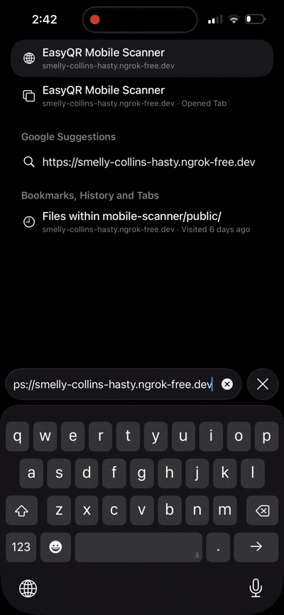

📦 TASK_2_2.md — Phase 2 · Task 2.2

Real-Time Scan Data Pipeline (Mobile → Desktop)

🧠 Task Overview

Task 2.2 extends the mobile scanning capability built in Task 2.1 by sending scanned QR / barcode data to the backend server in real time, establishing the foundation for live data streaming to the desktop app.<br>
This task proves that scan data is not just detected—but transmitted reliably across the system.<br>
🎯 Objectives (Completed)<br>
✅ Capture decoded QR / barcode data on mobile<br>
✅ Transmit scan payload to backend server<br>
✅ Maintain session context<br>
✅ Verify backend receives scan data<br>
✅ Prepare pipeline for desktop consumption<br>
🧩 What Was Implemented<br>
📱 Mobile Scanner<br>

Captures decoded scan result 
Sends scan payload via WebSocket
Prevents duplicate spam scans
Maintains active session state<br>

🌐 Backend Server
Listens for incoming scan events
Validates session
Logs received scan data
Keeps connection alive

🔁 Data Flow
```text


Mobile Camera
   ↓
QR / Barcode Detected
   ↓
Decoded Text
   ↓
WebSocket Message
   ↓
Backend Server Receives Scan
```
📸 Proof of Implementation
Below is a real screen recording demonstrating live scan detection.
🎥 Live Scan → Server Transmission
<p align="center">  </p>

✔ QR detected on mobile<br>
✔ Scan decoded successfully<br>
✔ Data transmitted instantly<br>
✔ Server logs confirm receipt<br>
```bash
📦 Sample Scan Payload
{
  "type": "SCAN_EVENT",
  "sessionId": "abc123",
  "value": "https://easyqr.dev",
  "timestamp": 1734321122334
}
```
🧪 Testing Performed

Manual scan testing (QR + Barcode)<br>
Rapid repeated scans (debounce verified)<br>
WebSocket connection stability test<br>
Server log verification<br>
Mobile browser compatibility (iOS & Android)
```text
📁 Files Updated
mobile-scanner/
 └── src/
     └── scanner.js   # Emits scan events
```
```text


server/
 └── src/
     └── wsServer.js  # Receives scan data
```
🏁 Task Boundary

✔ Included<br>
Scan transmission<br>
Backend receipt<br>
Session-based validation<br>
🚫 Not Included<br>
Desktop display<br>
Persistent storage<br>
Scan history UI<br>

🔮 Next Step — Task 2.3
Display real-time scan data on Desktop UI
(Mobile → Server → Desktop)

✅ Task Completion Checklist<br>
 Scan detected<br>
 Data transmitted<br>
 Server receives payload<br>
 Proof recorded<br>
 Documentation complete<br>
<p align="center"> <b>Task 2.2 successfully completed 🚀</b> </p>