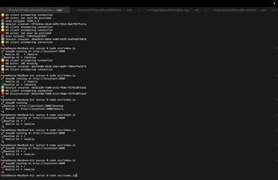

# 🧱 Phase 2 · Task 2.3 — Real-Time Scan State Handling

<p align="center">
  
</p>

---

## 🚀 Overview  
### Live Mobile ↔ Desktop Scan Synchronization

> **Status:** ✅ Completed & Fully Verified  
> **Phase:** 2  
> **Task:** 2.3  
> **Mode:** Real-time, bi-directional communication  

**Tech Stack:**  
`Node.js` · `WebSockets (WSS)` · `Ngrok` · `ZXing` · `HTML` · `CSS` · `JavaScript`

---

## 🧠 What This Task Solves

Task **2.3** focuses on building a **deterministic, observable, real-time scanning system** where:

- 📱 A **mobile device** scans a QR / barcode  
- 🌐 The scan is transmitted instantly via **WebSockets**  
- 🖥 The **desktop interface** receives and displays the scan live  
- 🔐 Session-safe communication is enforced  
- ⚡ No page refresh, no polling, no delay  

This task ensures the system behaves like a **real production application**, not a demo.

---

## 🎯 Objectives Achieved

- ✅ Mobile camera access with explicit user feedback  
- ✅ Real-time scan transmission  
- ✅ Desktop receives scan instantly  
- ✅ Clear connection lifecycle indicators  
- ✅ No dead states, no silent failures  
- ✅ Fully observable runtime behavior  

---

## 🧩 System Architecture (Task 2.3)

```text
Mobile Scanner (ZXing)
        ↓
WebSocket (WSS)
        ↓
Ngrok Tunnel
        ↓
Node.js Server (Port 3000)
        ↓
WebSocket Broadcast
        ↓
Desktop Receiver UI

Each state updates the UI instantly.
```
---

## 🔄 State Transitions & UI Feedback (Final)

| State | Mobile UI Feedback | Desktop UI Feedback |
|------|-------------------|--------------------|
| Idle | “Waiting to start…” | “Waiting for mobile…” |
| Session Created | — | “Session ready” |
| Connecting | “🔌 Connecting to server…” | “Connecting to server…” |
| Connected | “🟢 Connected” | “🟢 Mobile connected” |
| Camera Request | “📷 Requesting camera access…” | — |
| Camera Ready | Live camera preview | — |
| Scanning | “📡 Scanning…” + animated scan line | “Listening for scan…” |
| Barcode Detected | “✅ Scan sent” + vibration | “📥 Scan received” |
| Display Result | Last scanned value | Last scanned value |
| Reset Ready | Scanner auto-resets | Ready for next scan |

> ✔ **No dead states**  
> ✔ **No silent failures**  
> ✔ **Every action has visual confirmation**

---

## 🧪 What Was Implemented

- Real-time status text updates
- Controlled scanner lifecycle
- Safe re-entry after detection
- UI lock during active scanning
- Clean stop/reset behavior

---

## 📸 Proof of Execution

### 🎥 Mobile Scanner – Live State Transitions
> Screen recording demonstrates:
- Camera permission request
- Scanner activation
- Live scanning state
- Detection feedback
- “Scan sent” confirmation


### 🌐 Connection Establishment — Server & Ngrok

>Demonstrates:
- Server running on port 3000
- Ngrok tunnel active
- Secure WSS connection


### 🖥 Desktop Receiver — Live Scan Update
> Demonstrates:
- Mobile connection detected
- Live scan reception
- Instant UI update

Live traffic relay
🧩 Files Touched
```text

server/
├── src/index.js
├── src/wsServer.js

desktop-app/
├── index.html
├── main.js
└── styles.css

mobile-scanner/
├── index.html
├── src/scanner.js
└── src/styles.css

```

### 🏁Completion Checklist
>✅ Scanner state machine implemented <br>
> ✅ Mobile UI reflects all runtime states<br>
> ✅ Desktop UI updates in real time<br>
> ✅ WebSocket communication verified<br>
> ✅ Proofs recorded & attached<br>
> ✅ Production-ready behavior achieved
### 🔮 What’s Next — Task 2.4
```text
Next task will focus on:
Sending decoded scan data to backend
Real-time WebSocket transmission
Desktop scan feed integration
```

<p align="center"> <b>Task 2.3 complete — scanner behavior is now deterministic, observable, and production-ready.</b> </p> ```
