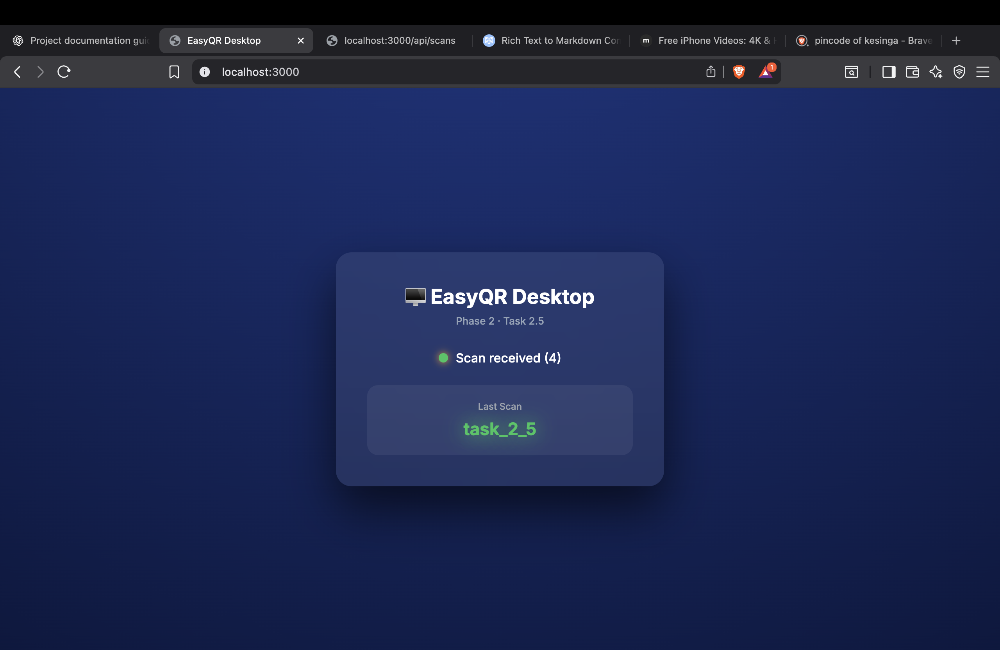

# 🗄️ Phase 2 · Task 2.5 — Scan Persistence & State Retention

<p align="center">
  
</p>

---

## 🚀 Overview

**Task 2.5** introduces **scan persistence** into the EasyQR system.

Until now, scans existed only in real-time.  
With this task, every scan is now **stored, retained, and replayable**, making the system resilient, debuggable, and production-ready.

> **Status:** ✅ Completed & Verified  
> **Phase:** Phase 2 — Data Handling Layer  
> **Scope:** In-memory persistence (upgradeable to DB)

---

## 🎯 Objectives

- Persist every scan event on the server
- Retain scan history per session
- Allow late-joining desktop clients to receive the latest scan
- Ensure no data loss during reconnects

---

## 🧠 Why This Matters

This task transforms the project from:

> “Live scan demo”

into

> **“State-aware real-time system”**

This enables:
- Reliable UX
- Reconnection safety
- Debugging & replay
- Backend scalability (Task 2.6+)

---

## 🗄️ Scan Storage Strategy

A new server module was introduced:

```
server/src/scanStore.js
```

### Responsibilities:
- Store scans per session
- Retrieve last scan on demand
- Maintain clean separation of concerns

---

## 📦 Scan Store Data Model

```js
{
  sessionId: "uuid",
  scans: [
    {
      value: "QR / Barcode text",
      format: "QR_CODE",
      timestamp: "ISO-8601",
      device: "mobile"
    }
  ]
}
```

✔ Session-scoped  
✔ Append-only  
✔ Easily replaceable with DB  

---

## 🔁 Data Flow (Final)

```text
Mobile Scanner
↓
Structured Scan Payload
↓
WebSocket (WSS)
↓
Node.js Server
↓
scanStore.save()
↓
Desktop Client (Live)
↓
UI Update
```

---

## 🛠 Implementation Summary

### 🌐 Server
- Added `scanStore.js`
- Persists scans per session
- Replays latest scan to desktop on connect

### 🖥 Desktop App
- Receives structured payload
- Displays last known scan instantly
- Handles reconnects gracefully

### 📱 Mobile App
- No changes required
- Continues sending structured payloads

---

## 🔄 State Improvements

| Scenario | Behavior |
|--------|----------|
| Desktop refresh | Last scan restored |
| Mobile reconnect | No data loss |
| Server restart | Memory reset (expected) |
| Multiple scans | Latest always shown |

---

## 🧪 Validation Checklist

✔ Scan stored server-side  
✔ Desktop receives latest scan on connect  
✔ Payload consistency maintained  
✔ No UI regressions  
✔ Clean separation of logic  
✔ Ready for DB persistence  

---

## 📸 Proof of Execution

### 🧠 Server Persistence
- Scan logged and stored
- Replay verified


### 🖥 Desktop Replay
- Page refresh restores scan




---

## 🧩 Files Introduced / Modified

```text
server/src/
├── scanStore.js   ← NEW
├── wsServer.js
└── index.js

desktop-app/
├── main.js
└── index.html
```

---

## 🏁 Completion Status

✅ Scan persistence implemented  
✅ Session-safe retention  
✅ Desktop replay working  
✅ Documentation complete  
✅ Production-ready foundation  

---

<p align="center">
  <b>Task 2.5 complete — EasyQR is now stateful, resilient, and scalable.</b>
</p>
