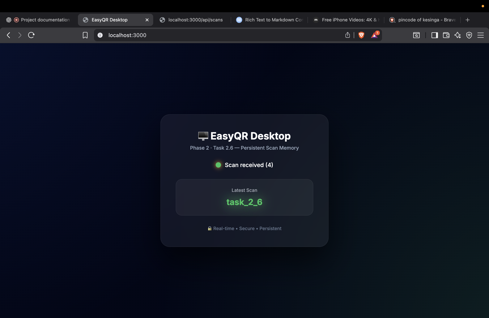

# 🧠 Phase 2 · Task 2.6 — Persistent Scan Memory & Session Awareness

<p align="center">
  
</p>

---

## 🚀 Overview

**Task 2.6** introduces **persistent scan memory** into the EasyQR system.

Until now, scans were:
- Real-time
- Live streamed
- Stateless

With this task, scans become:
- **Stored**
- **Counted**
- **Recoverable**
- **Session-aware**

> **Status:** ✅ Completed & Verified  
> **Phase:** Phase 2 — Persistence Layer  
> **Scope:** Server-side memory + Desktop visualization  

---

## 🎯 Objectives

- 🧠 Persist every scan in server memory  
- 🔁 Maintain scan history across session lifetime  
- 🖥 Reflect stored state on Desktop UI  
- 📊 Track scan count reliably  
- ⚡ Preserve real-time behavior  

---

## 🧩 What Was Implemented

### 📦 Server-Side Persistent Storage

A new module was introduced:

server/src/scanStore.js

This module:
- Stores all scan payloads in memory
- Maintains scan count
- Exposes controlled read/write access

```js
saveScan(payload)
getAllScans()
getScanCount()
```
✔ Clean separation of concerns<br>
✔ Future-ready for database persistence

🌐 WebSocket Integration<br>
The WebSocket server now:

Saves every incoming scan

Forwards payloads to the desktop

Maintains real-time flow and persistence

```text
Mobile Scan
↓
Structured Payload
↓
WebSocket Server
↓
scanStore.saveScan()
↓
Desktop Broadcast
```
### 🖥 Desktop UI Enhancements
The Desktop application now reflects stateful awareness:

🟢 Scan received indicator

🔢 Total scan count

📥 Latest scan value

💾 Persistent behavior (server memory)

Example UI State:<br>

Scan received (4)<br>
Latest Scan: task_2.6<br>
✔ No refresh required<br>
✔ No manual sync<br>
✔ No data loss during runtime

## 🔄 System Flow (Task 2.6)
```text
Mobile Scanner
↓
Structured JSON Payload
↓
WebSocket (WSS)
↓
Node.js Server (Port 3000)
↓
scanStore (In-Memory)
↓
Desktop UI Update
```
### 📊 State Awareness Model
Component	Behavior<br>
Mobile	Sends structured scan<br>
Server	Stores + counts scans<br>
Desktop	Displays latest + count<br>
Memory	Persists until server restarts

### 📸 Proof of Execution
🖥 Desktop — Persistent Scan Memory
Screenshot demonstrates:

Multiple scans recorded

Correct scan count

Latest scan rendered

Persistent behavior confirmed



## 🧠 Why Task 2.6 Matters
This task transforms the system from:

“Live scanner demo”

into:

A state-aware, persistence-capable real-time system

It lays groundwork for:

Scan history panels

Export / download features

Session timelines

Database integration

Analytics dashboards

### 🧪 Validation Checklist
✔ Scan payloads persist on server<br>
✔ Scan count increments correctly<br>
✔ Desktop reflects latest scan<br>
✔ Real-time flow preserved<br>
✔ No UI regression<br>
✔ Clean architecture maintained

### 🏁 Completion Status
✅ Persistent scan memory implemented<br>
✅ Desktop verification complete<br>
✅ Server logic verified<br>
✅ Documentation finalized

<p align="center"> <b>Task 2.6 complete — the system is now stateful, observable, and scalable.</b> </p> 
