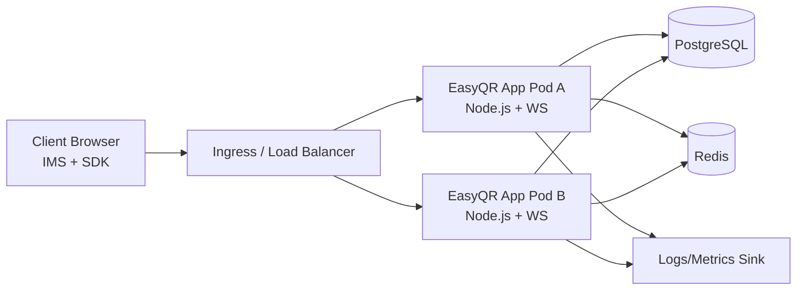
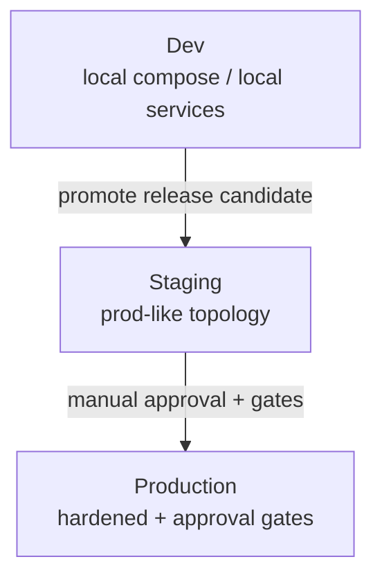

# Phase 5 Architecture — Infrastructure & Operations

## 1. Service Topology

## 2. Container Boundaries
- EasyQR app container:
  - REST + WS endpoints.
  - Stateless application layer.
  - Reads config via environment variables.
- PostgreSQL container/service:
  - Durable session/scan/security state.
  - Migration-controlled schema.
- Redis container/service:
  - Cross-node event propagation.
  - Rate-limit counters/pub-sub coordination.

## 3. Networking Model
- Ingress terminates TLS and forwards to app service.
- App instances communicate with Postgres/Redis on private network only.
- Postgres and Redis are not internet-exposed.
- CORS + WS origin allowlist enforced at app layer.

## 4. Environment Separation

### Dev
- Fast local iteration.
- Lower durability/SLO expectations.
- Synthetic test keys and sandbox domains.

### Staging
- Production-like infra and secrets model.
- Migration validation target.
- Load and failure drill environment.

### Production
- Highest uptime and audit requirements.
- Controlled rollout + rollback support.
- Strict monitoring + alerting thresholds.

## 5. Config & Secret Strategy
- Non-secret config: env vars committed via deployment manifests.
- Secrets: secret manager/K8s secrets, never plain repo files.
- Required secrets:
  - JWT signing secret.
  - DB connection secret.
  - Redis auth/URL (if secured).
  - Admin token.

## 6. Stateful Dependency Policy
- Postgres:
  - Automated backups + point-in-time restore.
  - Schema migration before traffic switch.
- Redis:
  - High availability recommended for production.
  - Graceful degraded mode behavior documented.

